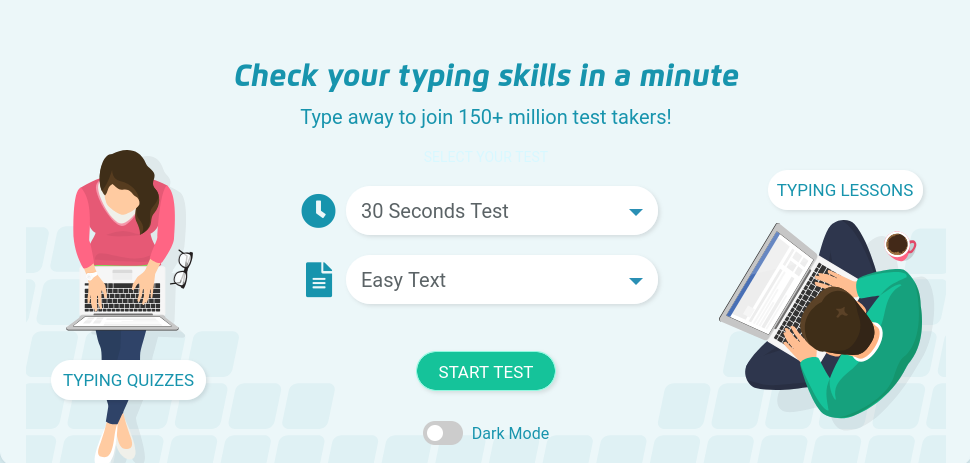

import '../../../css/checkbox.css'

Click on this website and take the typing test to check your current typing speed.
Set the settings for "2 Minute Test" and "Easy Text"

इस वेबसाइट पर जा कर अपनी टाइपिंग की रफ़्तार पता करें, कि आज के दिन आप कितनी तेज़ी से या कितने धीरे से टाइपिंग कर पा रहे हो।
शुरू करने से पहले, वेबसाइट की सेटिंग्स को "2 Minute Test" और "Easy Text" करें।

[https://www.typingtest.com/](https://www.typingtest.com/)

Fill this google form with the score of your Typing Speed.
पहली बार आपकी टाइपिंग की रफ़्तार कितनी थी? इस फॉर्म में भरें।

